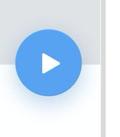

# Netflix Clone ( in progress )

</img>
</img>
</img>
</img>
</img>
</img>

---

## Table of contents:

- **[Technologies used](#technologies-used)**
- **[Usage](#usage)**

---

## Technologies used

This app launches with a [React web app](https://reactjs.org/) and [React Native app](https://facebook.github.io/react-native/) and [Renative] (https://renative.org/) sharing a single code base. It shares the 'business logic' (_i.e. actions, containers, reducers_) across the platforms, whilst allowing flexibility in View components to ensure your project looks and feels native in each platform.

- A shared React and React Native structure
- __State Management
    - [Context API]
- __Routing and navigation__
    - [react-navigation] for native mobile
    - [React Router] for web
- __API
    [https://developers.themoviedb.org/3/getting-started/introduction]
---
## Usage


#### 1. Clone and Install


git clone https://github.com/matiasmateu/netflix.git

#### 2. Run it !
```bash
npx rnv run -p ios 
npx rnv run -p web
```
