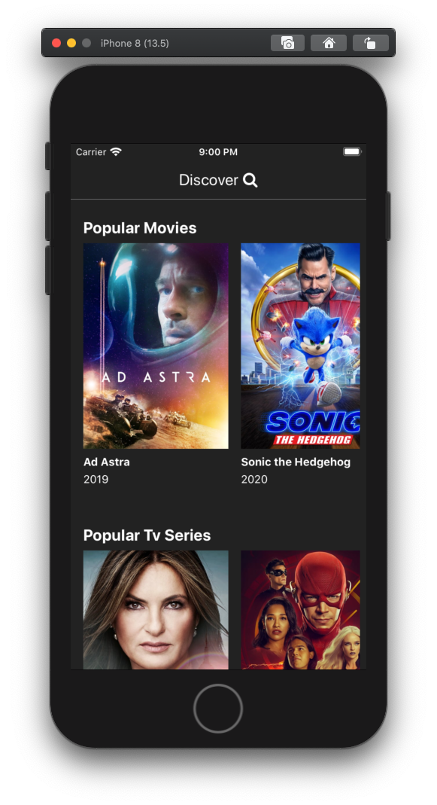
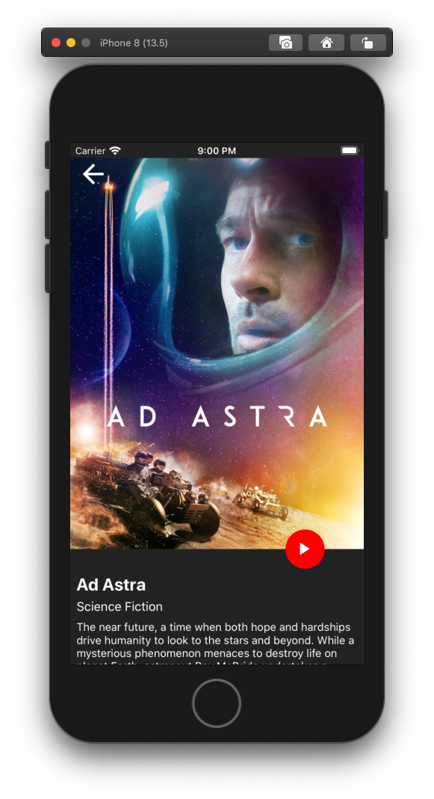
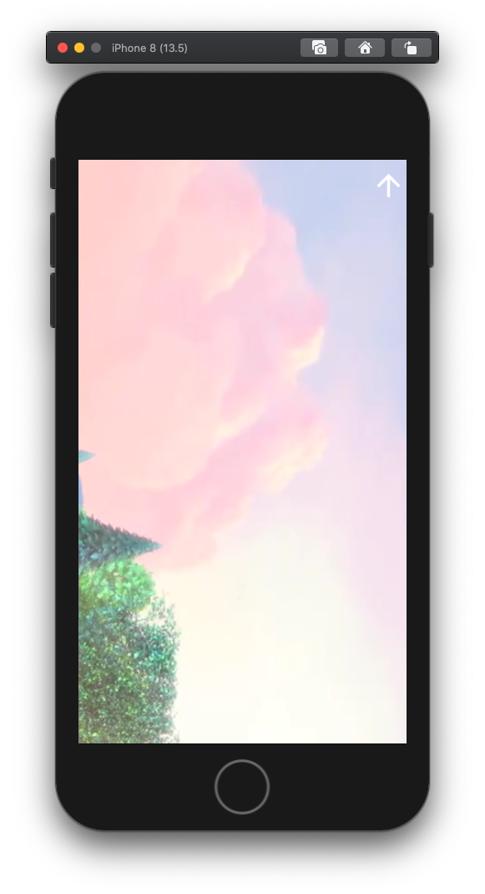
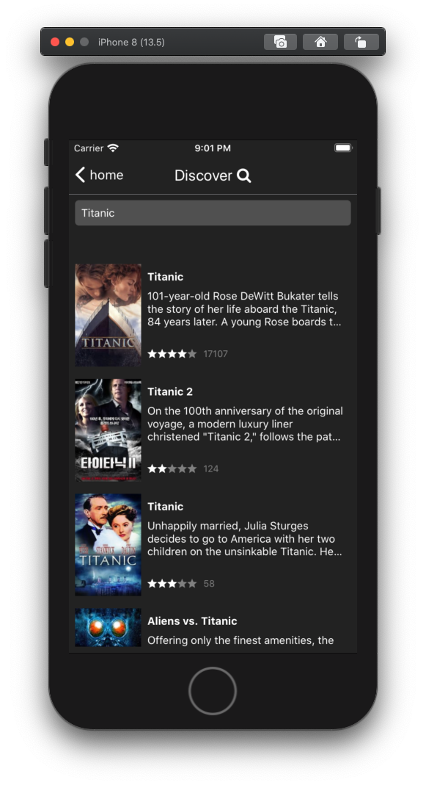

# Netflix Clone ( in progress )

</img>
</img>
</img>
</img>
</img>

---

## Table of contents:

- **[Technologies used](#technologies-used)**
- **[Usage](#usage)**

---

## Technologies used

[React]
[React Native]
[Renative Framework](https://renative.org/) that allows us to share a single code base and compile it in 11 different platforms. It shares the 'business logic' across the platforms, whilst allowing flexibility in View components to ensure your project looks and feels native in each platform.

- A shared React and React Native structure
- __State Management
    - [Context API]
- __Routing and navigation__
    - [react-navigation] for native mobile
    - [React Router] for web
- __API
    [https://developers.themoviedb.org]
---
## Usage


#### 1. Clone and Install

git clone https://github.com/matiasmateu/netflix.git

#### 2. Run it !
```bash
npx rnv run -p ios 
npx rnv run -p web
```
